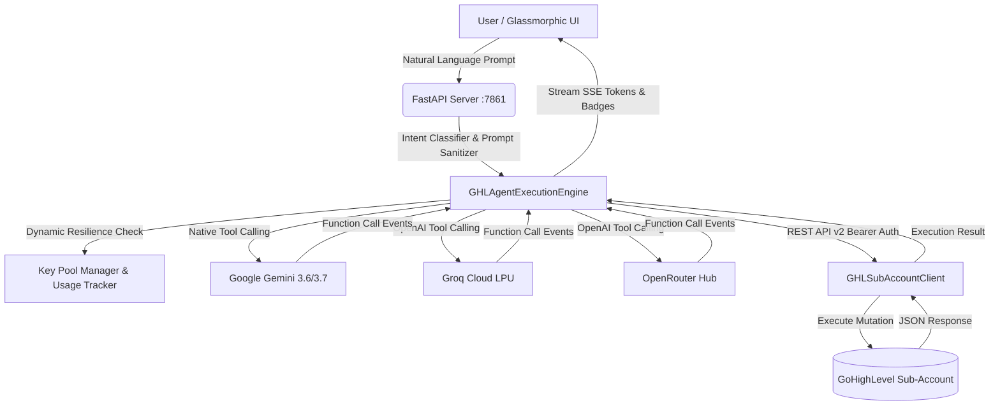

# 🤖 Conversation AI Copilot for GoHighLevel (GHL)

<p align="center">
  
  
  
  
  
  
  
</p>

> **An enterprise-grade, autonomous multi-model AI Action Execution Agent and conversational Copilot for GoHighLevel Sub-Accounts.** Powered by **Google Gemini**, **Groq Cloud (LPU)**, and **OpenRouter**, the system automates CRM configurations, contact creation, deal pipeline construction, custom fields, automated messaging, and vertical funnel generation directly from natural language prompts.

---

## 📚 Complete Documentation Index

For deep-dive technical references, architectural specs, and deployment manuals:

| Guide | Description |
| :--- | :--- |
| 🏛️ [**System Architecture**](docs/ARCHITECTURE.md) | High-level topology, SSE streaming protocol, failover mechanisms, prompt classification, and token management. |
| 🔌 [**API Reference Manual**](docs/API_REFERENCE.md) | Full specifications for REST endpoints, SSE stream schemas, request/response models, and cURL examples. |
| 🛠️ [**GoHighLevel Integration Guide**](docs/GHL_INTEGRATION_GUIDE.md) | Sub-Account Private Integrations, OAuth scopes, GHL REST API v2 SDK methods, and vertical CRM blueprints. |
| 🚀 [**Deployment & Configuration**](docs/DEPLOYMENT_AND_CONFIG.md) | Environment variables, local setup, Railway/Render cloud deployment, Docker, and Nginx reverse proxy. |

---

## 🌟 Key Highlights & Capabilities

- **🧠 Multi-Provider AI Engine with Native Tool Calling**:
  - **Google Gemini**: Gemini 3.6 Flash & Gemini 3.7 Flash with native function calling and multi-million token context.
  - **Groq Cloud**: Compound Mini & Qwen 3.8 27B running on dedicated LPUs for sub-second responses and automated tool execution.
  - **OpenRouter Gateway**: Access to xAI Grok, DeepSeek V4, Anthropic Claude 3.5 Sonnet, and free-tier fallback models.
- **⚡ Full GHL REST API v2 Native SDK**: Direct sub-account operations for Contacts, Pipelines, Deals/Opportunities, Custom Fields, Tags, Tasks, Internal Notes, and Outbound Conversations.
- **🛡️ Dynamic Key Pool & Self-Healing Resilience**:
  - Auto-polling of API key health and remaining credits.
  - Automatic key shifting on `429 (Rate Limit)` or `402 (Payment Required)`.
  - 65-second automatic cooldown recovery for temporary RPM limit resets.
- **📡 Server-Sent Events (SSE) Interactive Streaming**:
  - Step-by-step visual badges (`Invoking Tool` ➡️ `Tool Result`) streamed live to the UI.
  - Immediate token-by-token rendering with syntax-highlighted code blocks.
- **📊 Real-Time Token & Quota Tracker**:
  - Live tracking of daily request limits, daily token counts, and sliding-window TPM/RPM.
  - Persistent storage in `model_usage.json` with automatic UTC rollover and backup recovery.
- **📄 Authentic Portfolio RAG System**:
  - Grounded semantic retrieval engine parsing verified agency case studies from `PDF` and `DOCX` files.
  - Generates authentic, non-hallucinated case studies, KPI dashboard architectures, and Meta Ads technical proposals.
- **🎨 Glassmorphic Premium Dark UI**:
  - Responsive single-page interface with dynamic model selector, quick prompt chips, and sub-account credential manager.
- **🧙‍♂️ 6-Step Vertical Architecture Wizard**:
  - Step-by-step guided generator for Niche Selection, Funnel Goals, Landing Page Style, CRM Automations, Brand Customization, and Asset Review.
- **🏗️ Production-Ready Vertical Blueprints**:
  - Complete turnkey schema for Gym & Fitness Center CRM taxonomy (14 custom fields, 12 tags, and multi-stage retention pipelines).

---

## 🏗️ System Architecture



---

## 🤖 Supported Models & Providers

| Provider | Model Identifier | Category | Specialization & Quota |
| :--- | :--- | :--- | :--- |
| **Google Gemini** | `gemini-3.6-flash` | Google AI Studio | **Recommended** • 1M TPM • 15 RPM • Multi-Key Pool |
| **Google Gemini** | `gemini-3.7-flash` | Google AI Studio | Hybrid Reasoning • High Precision CRM Automations |
| **Groq Cloud** | `groq/compound-mini` | Groq Ultra-Fast | 70k TPM • 30 RPM • Ultra Low Latency LPU Inference |
| **Groq Cloud** | `qwen/qwen3.8-27b` | Groq Ultra-Fast | 8k TPM • 30 RPM • Tool Calling Enabled |
| **Puter.js Free** | `x-ai/grok-4.6` | Puter.js Free AI | State-of-the-Art xAI Grok • 100% Free In-Browser Engine |
| **OpenRouter** | `meta-llama/llama-3.3-70b-instruct` | OpenRouter Gateway | 60k TPM • Multi-Key Auto-Failover Pool |

---

## 🛠️ Supported GoHighLevel Action Tools

| Tool Name | GHL REST v2 Endpoint | Description |
| :--- | :--- | :--- |
| `create_contact` | `POST /contacts/` | Create or update contact with strict E.164 phone formatting and tags. |
| `search_contacts` | `GET /contacts/` | Search contacts by name, email, or phone number. |
| `create_pipeline` | `POST /opportunities/pipelines/` | Build custom opportunity pipelines with ordered stages. |
| `get_pipelines` | `GET /opportunities/pipelines/` | Retrieve existing pipelines and stage IDs for deal routing. |
| `create_opportunity` | `POST /opportunities/` | Create a deal card in a specific pipeline stage with monetary value. |
| `create_tag` | `POST /locations/{id}/tags` | Add a new tag to the location tag taxonomy. |
| `create_custom_field` | `POST /locations/{id}/customFields`| Create fields (`TEXT`, `NUMBER`, `DATE`, `SINGLE_OPTIONS`). |
| `send_conversation_message`| `POST /conversations/messages` | Send direct outbound SMS or Email to a contact. |
| `create_contact_task` | `POST /contacts/{id}/tasks` | Schedule a task with a due date assigned to a contact. |
| `create_contact_note` | `POST /contacts/{id}/notes` | Log internal team notes on a contact record. |
| `setup_gym_subaccount`| Batch Provisioning | Deploy complete 14-field, 12-tag Gym & Fitness Center blueprint. |

---

## 🚀 Quick Start Guide

### 1. Prerequisites
- **Python 3.10+**
- API Keys:
  - **Google Gemini API Key** (from [Google AI Studio](https://aistudio.google.com/))
  - **Groq Cloud API Key** (from [Groq Console](https://console.groq.com/))
  - *(Optional)* **OpenRouter API Key** (from [OpenRouter](https://openrouter.ai/))
- **GoHighLevel Location ID & Private Integration Bearer Token**

### 2. Installation

```bash
# Clone the repository
git clone https://github.com/muhammadokashapak/Conversation-AI-Copilot.git
cd Conversation-AI-Copilot

# Create and activate virtual environment
python -m venv venv

# Windows (PowerShell):
.\venv\Scripts\activate
# Linux/macOS:
source venv/bin/activate

# Install required packages
pip install -r requirements.txt
```

### 3. Environment Configuration
Copy the sample environment file and insert your API credentials:

```bash
cp .env.example .env
```

Edit `.env`:
```env
GEMINI_API_KEY=AIzaSy...
GROQ_API_KEY=gsk_...
OPENROUTER_API_KEY=sk-or-v1-...

PORT=7861
HOST=127.0.0.1
```

### 4. Run the Copilot
```bash
python app.py
```

Access the dashboard at:
👉 **`http://127.0.0.1:7861`**

---

## 📁 Repository Structure

```
Conversation-AI-Copilot/
├── agent_engine.py             # Multi-provider AI orchestration engine & tool calling
├── app.py                      # FastAPI server with SSE streaming & REST API endpoints
├── ghl_client.py               # GoHighLevel REST API v2 SDK (Contacts, Pipelines, Tags)
├── key_pool_manager.py         # Multi-key rotation, credit polling, and failover engine
├── usage_tracker.py            # Daily request/token tracking & sliding-window TPM/RPM
├── portfolio_knowledge_base.py # Document RAG engine (PDF/DOCX semantic retrieval)
├── gym_architecture.py         # Pre-built Gym & Fitness Center CRM blueprint
├── model_usage.json            # Persistent model quota & usage tracking state
├── requirements.txt            # Python dependencies
├── Procfile                    # Cloud process declaration (Heroku/Render)
├── railway.json                # Cloud deployment configuration for Railway
├── docs/                       # Comprehensive technical guides
│   ├── ARCHITECTURE.md         # System architecture & SSE specifications
│   ├── API_REFERENCE.md        # Complete REST & SSE API documentation
│   ├── GHL_INTEGRATION_GUIDE.md# GHL Private Integration & scope setup guide
│   └── DEPLOYMENT_AND_CONFIG.md# Production deployment, Docker, and Nginx guide
└── static/
    ├── index.html              # Glassmorphic single-page web application
    ├── style.css               # Design system, dark mode, and modal styles
    └── app.js                  # SSE client, model switcher, and interactive wizard
```

---

## 📄 License

This project is licensed under the **MIT License** — see the [LICENSE](LICENSE) file for details.
