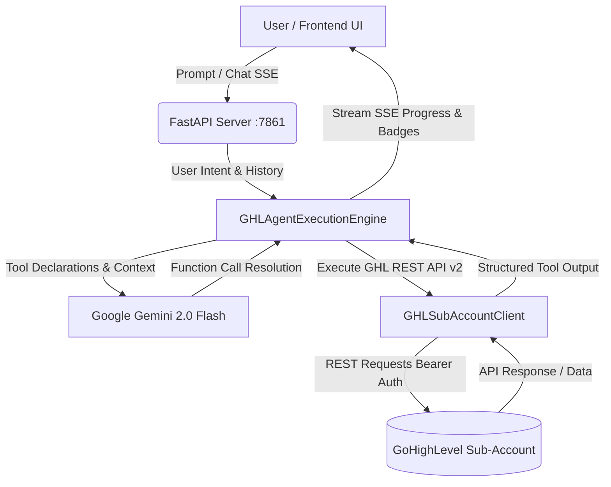

# 🤖 Conversation AI Copilot for GoHighLevel (GHL)

<p align="center">
  
  
  
  
  
</p>

> **An autonomous, intelligent Action Execution Agent and conversational Copilot designed for GoHighLevel Sub-Accounts.** Powered by Google Gemini Function Calling and GHL REST API v2 to automate CRM setup, contact management, deal pipelines, and automated multi-channel messaging from natural language prompts.

---

## 🌟 Key Highlights

- **🧠 Google Gemini 2.0 Function Calling**: Translates natural language instructions into concrete, multi-step API actions on GoHighLevel sub-accounts with zero manual JSON drafting.
- **⚡ Full GHL REST API v2 SDK**: Native handlers for Contacts, Pipelines, Deals/Opportunities, Custom Fields, Tags, Tasks, Internal Notes, and Conversations.
- **📡 Real-Time Streaming SSE**: Experience ultra-responsive Server-Sent Events with live execution badges showing step-by-step tool invocation status (`Invoking Tool` ➡️ `Tool Result`).
- **🎨 Glassmorphic Premium Dark UI**: Modern, responsive dashboard with chat sessions, sub-account connection modal, quick-prompt templates, and execution telemetry.
- **🏗️ Production-Ready Vertical Blueprints**: Includes complete schemas such as Gym & Fitness Center CRM taxonomy (custom fields, tags, and multi-stage retention pipelines).

---

## 🏗️ Architecture Overview



---

## 🛠️ Supported GHL Action Tools

| Tool Name | Description | Key Parameters |
| :--- | :--- | :--- |
| `create_contact` | Create or update a contact in the sub-account | `first_name`, `last_name`, `email`, `phone`, `tags` |
| `search_contacts` | Search existing contacts by query string | `query` (name, email, phone) |
| `create_pipeline` | Build a sales or retention pipeline with stages | `name`, `stages` (e.g. `['Lead', 'Booked', 'Won']`) |
| `get_pipelines` | Fetch all existing pipelines and stage IDs | _None_ |
| `create_opportunity` | Place a deal card into a pipeline stage | `pipeline_id`, `stage_id`, `title`, `monetary_value`, `status` |
| `create_tag` | Add a new tag to the location tag taxonomy | `tag_name` |
| `create_custom_field` | Create custom fields with types | `name`, `data_type` (`TEXT`, `NUMBER`, `DATE`, `SINGLE_OPTIONS`) |
| `send_conversation_message` | Send an SMS or Email to a contact | `contact_id`, `message`, `type_` (`SMS`/`Email`) |
| `create_contact_task` | Assign a task with a due date to a contact | `contact_id`, `title`, `due_date` |
| `create_contact_note` | Add an internal team note to a contact | `contact_id`, `body` |

---

## 🚀 Quick Start Guide

### 1. Prerequisites
- **Python 3.10+**
- **Google Gemini API Key** ([Get one here](https://aistudio.google.com/))
- **GoHighLevel Location ID & Private Integration Token (Bearer Token)**

### 2. Clone the Repository
```bash
git clone https://github.com/muhammadokashapak/Conversation-AI-Copilot.git
cd Conversation-AI-Copilot
```

### 3. Setup Virtual Environment & Dependencies
```bash
# Create virtual environment
python -m venv venv

# Activate virtual environment
# Windows:
.\venv\Scripts\activate
# Linux/macOS:
source venv/bin/activate

# Install dependencies
pip install -r requirements.txt
```

### 4. Configure Environment Variables
Copy `.env.example` to `.env` and insert your Gemini API Key:
```bash
cp .env.example .env
```
Inside `.env`:
```env
GEMINI_API_KEY=your_actual_gemini_api_key_here
PORT=7861
HOST=127.0.0.1
```

### 5. Run the Application
```bash
python app.py
```
Open your browser and navigate to:
👉 **`http://127.0.0.1:7861`**

---

## 📁 Repository Structure

```
Conversation-AI-Copilot/
├── agent_engine.py         # Google Gemini LLM function-calling orchestration engine
├── app.py                  # FastAPI server with SSE streaming endpoints & static file serving
├── ghl_client.py           # GoHighLevel REST API v2 Client SDK
├── gym_architecture.py     # Production vertical schemas (Gym & Fitness Center CRM setup)
├── requirements.txt        # Python package dependencies
├── .env.example            # Sample environment variables template
├── .gitignore              # Git ignore rules for virtual environments & secrets
├── static/
│   ├── index.html          # Modern dark-themed dashboard frontend
│   ├── style.css           # Glassmorphic CSS design system
│   └── app.js              # SSE client, chat state management, and tool renderers
└── README.md               # Project documentation
```

---

## 💡 Example Prompts to Try

* **Create Contacts & Opportunities:**
  > *"Create a new lead named 'Sarah Connor' with email 'sarah@skynet.com', tag 'VIP Lead', and add an opportunity worth $1,500 in the Solar Sales pipeline."*
* **Build Full Pipelines:**
  > *"Create a new pipeline called 'Gym Member Onboarding' with stages: Trial Booked, Assessment Completed, Member Signed, First Month Follow-up."*
* **Multi-Channel Engagement:**
  > *"Search for contact 'John Doe' and send him an SMS saying 'Hi John, your consultation has been confirmed for tomorrow at 3 PM!'"*
* **Custom Fields & Taxonomy:**
  > *"Create custom fields 'Membership Type' (SINGLE_OPTIONS) and 'Target Weight' (NUMBER) for our fitness sub-account."*

---

## 🛡️ Security & Privacy
- **API Keys Protected**: Never commit `.env` containing your live credentials or API tokens.
- **Location Sandboxing**: All operations are scoped strictly to the authenticated GoHighLevel Sub-Account (Location ID).

---

## 📄 License
This project is licensed under the **MIT License**. Feel free to use, modify, and distribute for personal and commercial projects.

---

<p align="center">
  Built with ❤️ for HighLevel Automators & AI Developers.
</p>
