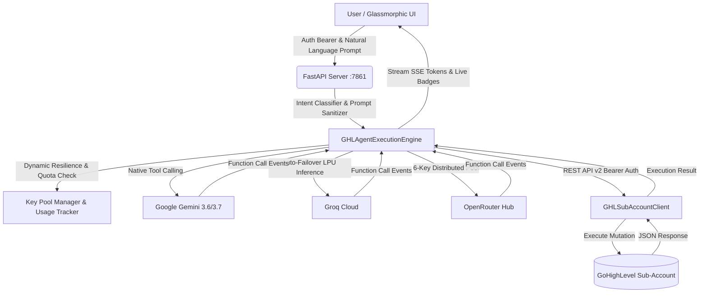

# 🤖 Conversation AI Copilot for GoHighLevel (GHL)

<p align="center">
  
  
  
  
  
  
  
  
</p>

> **An enterprise-grade, autonomous multi-model AI Copilot and Action Execution Agent for GoHighLevel (GHL) Sub-Accounts.** Powered by **Google Gemini**, **Groq Cloud (LPU)**, and **OpenRouter**, the system provides conversational CRM mutations, interactive multi-step funnels, intelligent document iteration, role-based access control, and self-healing multi-key resiliency directly from natural language prompts.

---

## 🏛️ Engineered by & Organization Credits

- **Author & Lead Architect:** **Muhammad Okasha** ([@muhammadokashapak](https://github.com/muhammadokashapak))
- **Organization / Company:** **XortLogix**
- **Repository:** [`Conversation-AI-Copilot`](https://github.com/muhammadokashapak/Conversation-AI-Copilot)
- **Deployment Endpoint:** `http://127.0.0.1:7861`

---

## 🌟 What's New (Recent Major Updates & Capabilities)

### 1. 🔐 Complete Authentication & Master Admin Suite
- **Role-Based Access Control (RBAC):** Built-in persistent user authentication via `users.json`.
- **Master Admin Privilege Mode:** Interactive admin suite allowing live password updates, role assignments, and user management directly from the UI.
- **Pre-configured Roles:**
  - **Master Admin:** Full platform control, password reset capabilities, and system oversight.
  - **Test User:** Sub-account level operator access for sandbox testing.

### 2. 🌪️ 100% Freeform Multi-Step Funnel & Landing Page Builder
- **Custom Business & Any Industry Support:** Move beyond preset categories—users can specify any niche (e.g., AI Agencies, Solar, Crypto Communities, MedSpas, Martial Arts Dojos).
- **Custom Pricing & Offers Engine:** Dedicated fields for Core Program Pricing (e.g., $997), VIP Upsells (e.g., $497), and custom payment mechanisms.
- **Freeform User Specifications:** Multi-line custom requirements textarea allowing users to dictate exact sections (Client Walls, VSL 80% Webhook Triggers, Custom Fields, Testimonial Grids).
- **Interactive Single-File Architecture:** Generates complete HTML/Tailwind CSS multi-step funnels with working client-side card validation and dynamic step-switching.

### 3. 🎨 Intelligent Document Iteration & Design Customizer
- **Context-Preserving Code Modification:** When a user uploads or pastes a landing page/funnel and requests design, color palette, or UI changes, the engine preserves 100% of the original business context while applying the new aesthetic.
- **Large Context Retention (Up to 35,000 Chars):** Eliminates truncation during revision passes, ensuring no steps or forms are lost.
- **Dedicated "Summary of Changes Made":** Automatically outputs an itemized changelog detailing old vs. new color codes, button states, typography, and layout refinements.

### 4. 🔄 Resilient Model Chaining & Multi-Key Failover
- **Auto-Handover Cascade:** If Google Gemini hits upstream quota limits mid-generation, generation automatically transfers to Groq Cloud (Qwen 3.8 / Compound Mini) and OpenRouter (Llama 3.3 70B 6-key pool) from the exact cutoff character.
- **Real-Time Token Budgeting:** Saves 1,600+ tokens per generation turn by dynamically trimming redundant system instructions.

---

## 📚 Complete Technical Documentation

| Document | Description |
| :--- | :--- |
| 🏛️ [**System Architecture**](docs/ARCHITECTURE.md) | High-level topology, SSE streaming protocol, failover mechanisms, prompt classification, and token management. |
| 🔌 [**API Reference Manual**](docs/API_REFERENCE.md) | Full specifications for REST endpoints, SSE stream schemas, request/response models, and cURL examples. |
| 🛠️ [**GoHighLevel Integration Guide**](docs/GHL_INTEGRATION_GUIDE.md) | Sub-Account Private Integrations, OAuth scopes, GHL REST API v2 SDK methods, and vertical CRM blueprints. |
| 🚀 [**Deployment & Configuration**](docs/DEPLOYMENT_AND_CONFIG.md) | Environment variables, local setup, Railway/Render cloud deployment, Docker, and Nginx reverse proxy. |

---

## 🏗️ System Topology & Data Flow



---

## 🤖 Supported Models & Inference Providers

| Provider | Model Identifier | Category | Specialization & Quota |
| :--- | :--- | :--- | :--- |
| **Google Gemini** | `gemini-3.6-flash` | Google AI Studio | **Recommended** • 1M TPM • 15 RPM • Multi-Key Pool |
| **Google Gemini** | `gemini-3.7-flash` | Google AI Studio | Hybrid Reasoning • High Precision CRM Automations |
| **Groq Cloud** | `groq/compound-mini` | Groq Ultra-Fast | 70k TPM • 30 RPM • Ultra Low Latency LPU Inference |
| **Groq Cloud** | `qwen/qwen3.8-27b` | Groq Ultra-Fast | 8k TPM • 30 RPM • Fast Code Generation & Handover |
| **OpenRouter** | `meta-llama/llama-3.3-70b-instruct` | OpenRouter Gateway | 60k TPM • 6-Key Auto-Failover Pool |
| **Puter.js Free** | `x-ai/grok-4.6` | In-Browser Engine | Free Tier Auxiliary Fallback |

---

## 🛠️ Supported GoHighLevel Action Tools

| Tool Name | GHL REST v2 Endpoint | Operational Description |
| :--- | :--- | :--- |
| `create_contact` | `POST /contacts/` | Create or update contact with strict E.164 phone formatting and tags. |
| `search_contacts` | `GET /contacts/` | Search contacts by name, email, or phone number. |
| `create_pipeline` | `POST /opportunities/pipelines/` | Build custom opportunity pipelines with ordered stages. |
| `get_pipelines` | `GET /opportunities/pipelines/` | Retrieve existing pipelines and stage IDs for deal routing. |
| `create_opportunity` | `POST /opportunities/` | Create a deal card in a specific pipeline stage with monetary value. |
| `create_tag` | `POST /locations/{id}/tags` | Add a new tag to the location tag taxonomy. |
| `create_custom_field` | `POST /locations/{id}/customFields`| Create fields (`TEXT`, `NUMBER`, `DATE`, `SINGLE_OPTIONS`). |
| `send_conversation_message`| `POST /conversations/messages` | Send direct outbound SMS or Email to a contact. |
| `create_contact_task` | `POST /contacts/{id}/tasks` | Schedule a task with a due date assigned to a contact. |
| `create_contact_note` | `POST /contacts/{id}/notes` | Log internal team notes on a contact record. |
| `setup_gym_subaccount`| Batch Provisioning | Deploy turnkey 14-field, 12-tag Gym & Fitness Center blueprint. |

---

## 🚀 Quick Start & Installation

### 1. Prerequisites
- **Python 3.10+**
- **Git**
- API Keys:
  - **Google Gemini API Key** (from [Google AI Studio](https://aistudio.google.com/))
  - **Groq Cloud API Key** (from [Groq Console](https://console.groq.com/))
  - *(Optional)* **OpenRouter API Key** (from [OpenRouter](https://openrouter.ai/))
- **GoHighLevel Location ID & Private Integration Bearer Token**

### 2. Setup Repository

```bash
# Clone the repository
git clone https://github.com/muhammadokashapak/Conversation-AI-Copilot.git
cd Conversation-AI-Copilot

# Create and activate virtual environment
python -m venv venv

# Windows (PowerShell):
.\venv\Scripts\activate
# Linux/macOS:
source venv/bin/activate

# Install dependencies
pip install -r requirements.txt
```

### 3. Environment Configuration
Copy the sample environment file and add your credentials:

```bash
cp .env.example .env
```

Configure `.env`:
```env
GEMINI_API_KEY=AIzaSy...
GROQ_API_KEY=gsk_...
OPENROUTER_API_KEY=sk-or-v1-...

PORT=7861
HOST=127.0.0.1
```

### 4. Launch Copilot Server
```bash
python app.py
```

Access the application in your browser:
👉 **`http://127.0.0.1:7861`**

---

## 📁 Repository Structure

```
Conversation-AI-Copilot/
├── agent_engine.py             # Multi-provider AI orchestration & tool calling engine
├── app.py                      # FastAPI server, auth endpoints, and SSE stream handlers
├── users.json                  # Persistent RBAC authentication store
├── ghl_client.py               # GoHighLevel REST API v2 SDK (Contacts, Pipelines, Tags)
├── key_pool_manager.py         # Multi-key rotation, credit polling, and failover engine
├── usage_tracker.py            # Daily request/token tracking & sliding-window TPM/RPM
├── portfolio_knowledge_base.py # Document RAG engine (PDF/DOCX semantic retrieval)
├── gym_architecture.py         # Turnkey Gym & Fitness Center CRM blueprint
├── model_usage.json            # Persistent model quota & usage tracking state
├── requirements.txt            # Python dependencies
├── Procfile                    # Cloud process declaration (Heroku/Render)
├── railway.json                # Cloud deployment configuration for Railway
├── docs/                       # Comprehensive technical guides
│   ├── ARCHITECTURE.md         # System architecture & SSE specifications
│   ├── API_REFERENCE.md        # Complete REST & SSE API documentation
│   ├── GHL_INTEGRATION_GUIDE.md# GHL Private Integration & scope setup guide
│   └── DEPLOYMENT_AND_CONFIG.md# Production deployment, Docker, and Nginx guide
└── static/
    ├── index.html              # Glassmorphic single-page web app with admin suite
    ├── style.css               # Design system, dark mode tokens, and wizard styles
    └── app.js                  # Frontend state controller, SSE client, and wizard engine
```

---

## 📄 License & Attribution

This project is licensed under the **MIT License** — see the [LICENSE](LICENSE) file for details.  
Built with dedication by **Muhammad Okasha** for **XortLogix**.
