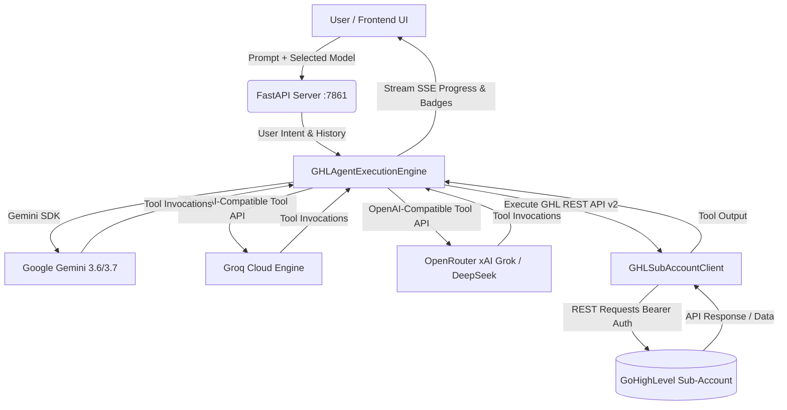

# 🤖 Conversation AI Copilot for GoHighLevel (GHL)

<p align="center">
  
  
  
  
  
  
</p>

> **An autonomous, multi-model AI Action Execution Agent and conversational Copilot for GoHighLevel Sub-Accounts.** Powered by **Google Gemini**, **Groq Cloud (LPU)**, and **OpenRouter (xAI Grok, DeepSeek, Claude 3.5, GPT-4o)** to automate CRM setup, contact management, deal pipelines, and automated multi-channel messaging directly from natural language prompts.

---

## 🌟 Key Highlights

- **🧠 Multi-Provider AI Engine**:
  - **Google Gemini**: Gemini 3.6 Flash, Gemini 3.7 Flash, Gemini 3.5 Flash (Native Tool Calling).
  - **Groq Cloud**: Qwen 3.8 27B, Qwen 3.6 27B, GPT-OSS 20B (Sub-second LPU Inference & Function Calling).
  - **OpenRouter Hub**: xAI Grok (Grok 4.6, 4.5), DeepSeek (V4 Flash, V4 Pro, V3.2), Anthropic Claude 3.5 Sonnet, OpenAI GPT-4o, and 100% Free-tier models.
- **⚡ Full GHL REST API v2 SDK**: Native handlers for Contacts, Pipelines, Deals/Opportunities, Custom Fields, Tags, Tasks, Internal Notes, and Conversations.
- **📡 Real-Time Streaming SSE**: Server-Sent Events with live execution badges showing step-by-step tool invocation status (`Invoking Tool` ➡️ `Tool Result`).
- **🎨 Glassmorphic Premium Dark UI**: Dynamic model selector with categorized provider groups (`Google Gemini`, `Groq Ultra-Fast`, `xAI Grok & DeepSeek`, `Free Tier Models`, `Flagship AI`), sub-account connection modal, quick prompt cards, and CRM hubs.
- **🏗️ Production-Ready Vertical Blueprints**: Complete schema templates for Gym & Fitness Center CRM taxonomy (custom fields, tags, and multi-stage retention pipelines).

---

## 🏗️ Architecture Overview



---

## 🤖 Supported Models & Providers

| Provider | Category | Featured Models | Capabilities |
| :--- | :--- | :--- | :--- |
| **Google Gemini** | Google AI Studio | `gemini-3.6-flash`, `gemini-3.7-flash`, `gemini-3.5-flash` | Native Tool Calling, Fast & Smart |
| **Groq Cloud** | LPU Hardware | `qwen/qwen3.8-27b`, `qwen/qwen3.6-27b`, `openai/gpt-oss-20b` | Ultra Low Latency, Tools Enabled |
| **OpenRouter** | xAI Grok | `x-ai/grok-4.6`, `x-ai/grok-4.5`, `x-ai/grok-4.3` | Direct Grok Reasoning Engine |
| **OpenRouter** | DeepSeek AI | `deepseek/deepseek-v4-flash`, `deepseek/deepseek-v4-pro`, `deepseek/deepseek-v3.2` | Advanced Reasoning & Code |
| **OpenRouter** | Free Tier | `inclusionai/ling-3.0-flash-fin:free`, `dots-studio/dots-3-note-preview:free` | 100% Free Conversational AI |
| **OpenRouter** | Flagship AI | `anthropic/claude-3.5-sonnet`, `openai/gpt-4o`, `meta-llama/llama-3.3-70b-instruct` | State-of-the-Art Agent Intelligence |

---

## 🛠️ Supported GHL Action Tools

| Tool Name | Description | Key Parameters |
| :--- | :--- | :--- |
| `create_contact` | Create or update a contact in the sub-account | `first_name`, `last_name`, `email`, `phone`, `tags` |
| `search_contacts` | Search existing contacts by query string | `query` (name, email, phone) |
| `create_pipeline` | Build a sales or retention pipeline with stages | `name`, `stages` (e.g. `['Lead', 'Booked', 'Won']`) |
| `get_pipelines` | Fetch all existing pipelines and stage IDs | _None_ |
| `create_opportunity` | Place a deal card into a pipeline stage | `pipeline_id`, `stage_id`, `title`, `monetary_value`, `status` |
| `create_tag` | Add a new tag to the location tag taxonomy | `tag_name` |
| `create_custom_field` | Create custom fields with types | `name`, `data_type` (`TEXT`, `NUMBER`, `DATE`, `SINGLE_OPTIONS`) |
| `send_conversation_message` | Send an SMS or Email to a contact | `contact_id`, `message`, `type_` (`SMS`/`Email`) |
| `create_contact_task` | Assign a task with a due date to a contact | `contact_id`, `title`, `due_date` |
| `create_contact_note` | Add an internal team note to a contact | `contact_id`, `body` |

---

## 🚀 Quick Start Guide

### 1. Prerequisites
- **Python 3.10+**
- **API Keys**:
  - Google Gemini API Key
  - Groq Cloud API Key
  - OpenRouter API Key
- **GoHighLevel Location ID & Access Token (Bearer Token)**

### 2. Clone the Repository
```bash
git clone https://github.com/muhammadokashapak/Conversation-AI-Copilot.git
cd Conversation-AI-Copilot
```

### 3. Setup Virtual Environment & Dependencies
```bash
python -m venv venv

# Windows:
.\venv\Scripts\activate
# Linux/macOS:
source venv/bin/activate

pip install -r requirements.txt
```

### 4. Configure Environment Variables
Copy `.env.example` to `.env` and insert your API keys:
```bash
cp .env.example .env
```
Inside `.env`:
```env
GEMINI_API_KEY=your_gemini_api_key
GROQ_API_KEY=your_groq_api_key
OPENROUTER_API_KEY=your_openrouter_api_key

PORT=7861
HOST=127.0.0.1
```

### 5. Run the Application
```bash
python app.py
```
Open your browser at:
👉 **`http://127.0.0.1:7861`**

---

## 📁 Repository Structure

```
Conversation-AI-Copilot/
├── agent_engine.py         # Multi-provider AI orchestration engine (Gemini, Groq, OpenRouter)
├── app.py                  # FastAPI server with SSE streaming & model catalog endpoints
├── ghl_client.py           # GoHighLevel REST API v2 Client SDK
├── gym_architecture.py     # Production vertical schemas (Gym & Fitness Center CRM setup)
├── requirements.txt        # Python package dependencies
├── .env.example            # Sample environment variables template
├── .gitignore              # Git ignore rules for virtual environments & secrets
├── static/
│   ├── index.html          # Modern dark-themed dashboard frontend
│   ├── style.css           # Glassmorphic CSS design system with model selector styling
│   └── app.js              # SSE client, dynamic model loader, and tool renderers
└── README.md               # Project documentation
```

---

## 📄 License
This project is licensed under the **MIT License**.
