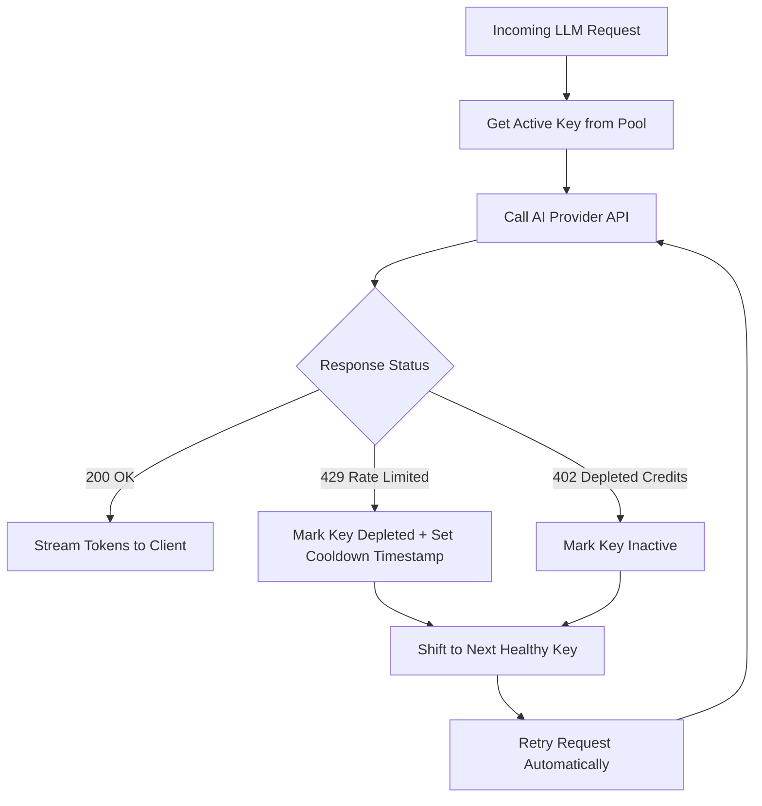

# 🏛️ System Architecture & Engineering Specifications
## Conversation AI Copilot for GoHighLevel (GHL)

This document provides a comprehensive technical breakdown of the internal architecture, orchestration pipelines, resilient failover mechanisms, and data flows powering the **Conversation AI Copilot for GoHighLevel**.

---

## 1. High-Level Architecture Topology

```mermaid
graph TB
    subgraph ClientLayer ["Client & Frontend Layer (Browser)"]
        UI["Glassmorphic Web App<br/>(static/index.html & app.js)"]
        SSEListener["SSE Stream Consumer & Parser"]
        ModelSelector["Dynamic Model & Quota Switcher"]
        GHLModal["Sub-Account Connector & Cache"]
        Wizard["6-Step Vertical Funnel Wizard"]
    end

    subgraph FastAPILayer ["FastAPI Web Application (Port 7861)"]
        App["app.py (FastAPI App)"]
        CORSMiddleware["CORS & Static Router"]
        Routes["REST & SSE Endpoints<br/>(/api/models, /api/chat-agent, /api/ghl/*)"]
    end

    subgraph CoreEngine ["Autonomous Agent Execution Core"]
        IntentEngine["Intent Classifier & Prompt Optimizer<br/>(classify_prompt_intent)"]
        AgentEngine["GHLAgentExecutionEngine<br/>(agent_engine.py)"]
        RuleEngine["29 Senior GHL Architectural Rules<br/>(System Prompt Injector)"]
        HistoryCompressor["Turn History Compression & Turn Hygiene"]
    end

    subgraph ResilienceAndTracking ["Key Pool & Resource Management"]
        KeyPoolMgr["Key Pool Manager<br/>(key_pool_manager.py)"]
        GeminiPool["GeminiKeyPool<br/>(Auto-recover 65s cooldown)"]
        OpenRouterPool["OpenRouterKeyPool<br/>(Credit Polling & 402/429 Fallback)"]
        UsageTracker["ModelUsageTracker<br/>(Sliding Window & model_usage.json)"]
    end

    subgraph RAGEngine ["Semantic Retrieval Engine (RAG)"]
        PortfolioKB["PortfolioKnowledgeBase<br/>(portfolio_knowledge_base.py)"]
        Embeddings["Vector Embeddings & Overlap Scoring"]
        DocsSource["Verified Docs (PDF & DOCX Case Studies)"]
    end

    subgraph AIProviders ["External AI Provider APIs"]
        GeminiAPI["Google GenAI SDK<br/>(Gemini 3.6 / 3.7 Flash)"]
        GroqAPI["Groq Cloud LPU API<br/>(Compound Mini, Qwen 3.8 27B)"]
        OpenRouterAPI["OpenRouter Gateway<br/>(xAI Grok, DeepSeek, Claude, Free Tier)"]
        RapidAPI["RapidAPI Fallback Gateway"]
    end

    subgraph GHLIntegration ["GoHighLevel REST API v2 SDK"]
        SDK["GHLSubAccountClient<br/>(ghl_client.py)"]
        GHLAPI["GHL Cloud Services<br/>(https://services.leadconnectorhq.com)"]
        SubAccount[("Target Sub-Account<br/>Contacts, Pipelines, Deals, Tags")]
    end

    UI -->|HTTP POST JSON| Routes
    Routes --> IntentEngine
    IntentEngine --> AgentEngine
    AgentEngine --> RuleEngine
    AgentEngine --> HistoryCompressor
    AgentEngine --> PortfolioKB
    DocsSource --> PortfolioKB

    AgentEngine --> KeyPoolMgr
    KeyPoolMgr --> GeminiPool
    KeyPoolMgr --> OpenRouterPool
    AgentEngine --> UsageTracker

    AgentEngine -->|Native Function Calling| GeminiAPI
    AgentEngine -->|OpenAI Tool Calling| GroqAPI
    AgentEngine -->|OpenAI Tool Calling| OpenRouterAPI
    AgentEngine --> RapidAPI

    GeminiAPI & GroqAPI & OpenRouterAPI -->|Function Invocations| AgentEngine
    AgentEngine -->|Execute Tool Call| SDK
    SDK -->|REST API v2 (Bearer Auth)| GHLAPI
    GHLAPI --> SubAccount
    SDK -->|Execution Output| AgentEngine

    AgentEngine -->|SSE Stream Events| Routes
    Routes -->|text/event-stream| SSEListener
    SSEListener --> UI
```

---

## 2. Core Subsystems & Components

### 2.1 Web Service & Routing Layer (`app.py`)
- Built on **FastAPI** with asynchronous request handling (`uvicorn`).
- Operates on configurable port (default `7861`, bind host `0.0.0.0` or `127.0.0.1`).
- Serves the compiled dark glassmorphic single-page application from `static/`.
- Implements connection result caching (`_conn_cache`) with a 300-second TTL to avoid redundant round-trips to GoHighLevel when verifying credentials.
- Exposes Server-Sent Events (SSE) via `StreamingResponse` for sub-second, token-by-token generation and interactive tool invocation progress.

### 2.2 Agent Execution Engine (`agent_engine.py`)
The autonomous agent core is responsible for:
1. **Prompt Intent Classification**: Analyzes incoming prompts using compiled regex and keyword sets to detect four distinct interaction modes:
   - `full_build`: Massive landing page, complete CRM architecture, or complete asset bundle requests.
   - `proposal_or_qa`: Proposal generation, job/interview audits, or technical assessments.
   - `iteration`: Incremental styling, color changes, field modifications, or copy tweaks.
   - `quick_answer`: Concise technical questions and single-action inquiries.
2. **Adaptive Output Budgeting & Temperature**:
   - Dynamic token ceilings per intent and provider (e.g., up to 8,192 tokens for full builds).
   - Deterministic `temperature = 0.1` during tool calling to guarantee valid JSON arguments.
   - `temperature = 0.7` for creative copy and landing page structuring.
   - Zero thinking budget configured for instant time-to-first-token.
3. **Turn History Compression & Alternating Turn Hygiene**:
   - Truncates oversized assistant replies to preserve token budget.
   - Enforces strict alternating turn discipline (User ↔ Assistant) required by strict LLM APIs (such as Gemini and Anthropic).
4. **Tool Calling & Execution Loop**:
   - Declares GHL tools in native Google GenAI schema and OpenAI-compatible function calling specifications.
   - Automatically executes requested tools through `GHLSubAccountClient`.
   - Feeds tool output back to the LLM model to synthesize the final user-facing response.

---

## 3. Server-Sent Events (SSE) Streaming Protocol

The `/api/chat-agent` endpoint streams real-time events over `text/event-stream`. Each event is formatted as `data: <JSON_PAYLOAD>\n\n`.

### Event Types:

| Event Type | Payload Schema | Description |
| :--- | :--- | :--- |
| `status` | `{"type": "status", "message": str}` | Status update (e.g., `"🔍 Checking GHL credentials..."`). |
| `chunk` | `{"type": "chunk", "text": str}` | Tokenized text fragment streamed for instant UI markdown rendering. |
| `tool_call` | `{"type": "tool_call", "name": str, "args": dict}` | Emitted immediately when the LLM triggers a tool. Frontend renders an active execution badge. |
| `tool_result` | `{"type": "tool_result", "name": str, "result": dict, "success": bool}` | Emitted when tool finishes executing against GHL API. |
| `usage_update` | `{"type": "usage_update", "model": str, "stats": dict}` | Real-time token and request usage stats after completion. |
| `done` | `{"type": "done"}` | Signals completion of the response stream. |

#### Example SSE Stream Sequence:
```http
HTTP/1.1 200 OK
Content-Type: text/event-stream
Cache-Control: no-cache
Connection: keep-alive

data: {"type": "status", "message": "🤖 Analyzing intent and preparing tool execution..."}

data: {"type": "tool_call", "name": "create_contact", "args": {"first_name": "Marcus", "last_name": "Vance", "email": "marcus@ironpulse.io", "tags": ["VIP Member"]}}

data: {"type": "tool_result", "name": "create_contact", "result": {"success": true, "message": "✅ Contact 'Marcus Vance' created successfully."}, "success": true}

data: {"type": "chunk", "text": "I have created the contact for **Marcus Vance** in your GoHighLevel sub-account with the tag `VIP Member`."}

data: {"type": "usage_update", "model": "gemini-3.6-flash", "stats": {"daily_requests": 14, "daily_tokens": 8420, "usage_percentage": 0.84}}

data: {"type": "done"}
```

---

## 4. Multi-Key Pool & Failover Resilience Architecture

To protect against provider rate limits (`HTTP 429 Too Many Requests`) and depleted credits (`HTTP 402 Payment Required`), the system includes a dedicated `key_pool_manager.py`.



### Key Management Features:
1. **Gemini Key Pool (`GeminiKeyPool`)**:
   - Supports single `GEMINI_API_KEY` or comma-delimited `GEMINI_API_KEYS`.
   - Tracks success/failure counts per key.
   - **Auto-Recovery**: If a key hits RPM limits (`429`), it is quarantined for a 65-second cooldown window, after which it is automatically re-instated as healthy.
2. **OpenRouter Key Pool (`OpenRouterKeyPool`)**:
   - Supports comma-separated `OPENROUTER_API_KEYS`.
   - Real-time credit balance polling via `https://openrouter.ai/api/v1/auth/key`.
   - Automatic shift to alternative keys if credits fall below threshold or return 402/429.
3. **Cross-Provider Fallback**:
   - If Google Gemini experiences unexpected transient downtime, execution gracefully routes to Groq LPU models or OpenRouter fallback models.

---

## 5. Token & Quota Usage Tracker (`usage_tracker.py`)

A persistent usage monitoring system tracks consumption across all registered models:
- **Metrics Tracked**:
  - Daily Request Count (`daily_requests`)
  - Daily Token Count (`daily_tokens`)
  - Sliding-window Tokens Per Minute (TPM)
  - Sliding-window Requests Per Minute (RPM)
  - Percentage of daily quota remaining
- **Persistence**:
  - Saved to `model_usage.json` with automatic fallback restoration from `.bak` backup.
  - Automatically resets counters when UTC calendar day rolls over (`_get_current_day()`).

---

## 6. RAG & Knowledge Base Engine (`portfolio_knowledge_base.py`)

The Copilot features an authentic, verifiable Retrieval-Augmented Generation (RAG) system grounded in real agency project records:
- **Indexed Sources**:
  - `KPI Scope .pdf`: Technical KPI requirements, multi-account architecture, data pipelines.
  - `XortLogix_Facebook_Analytics_Dashboard_Project_Document.docx`: Real-world Meta Ads integration, webhook pipelines, reporting dashboards.
- **Dual Retrieval Pipeline**:
  1. **Dense Vector Search**: Semantic cosine similarity matching using pre-computed vector embeddings.
  2. **Sparse Keyword Overlap**: Fast term-frequency overlap scoring for exact term matching.
- **Dynamic Context Injection**:
  - When the user asks about case studies, past projects, KPI tracking, or custom dashboards, verified proof snippets are automatically retrieved and prepended to the system prompt.
  - Guarantees zero hallucinations and authentic agency citations.

---

## 7. GoHighLevel REST API v2 Integration (`ghl_client.py`)

All CRM mutations execute against GoHighLevel's official REST API v2:
- **Base URL**: `https://services.leadconnectorhq.com`
- **API Version Header**: `Version: 2021-07-28`
- **Authentication**: Location Private Integration Bearer Token (`Authorization: Bearer <token>`)

### Supported Operations:
- **Contacts**: Search by name/email/phone, create new contact with custom fields and tags, update existing records.
- **Pipelines & Opportunities**: Fetch pipelines and stages, build multi-stage pipelines, create and move opportunity cards.
- **Taxonomy**: Create tags, create custom fields (`TEXT`, `NUMBER`, `DATE`, `SINGLE_OPTIONS`).
- **Communications**: Send direct outbound SMS or Email through GHL conversation channels.
- **Tasks & Internal Notes**: Create time-stamped tasks with due dates and internal team notes attached to contacts.
- **Vertical Architecture Deployment**: 1-click provisioning of complete CRM infrastructures (e.g., `setup_gym_subaccount`).
